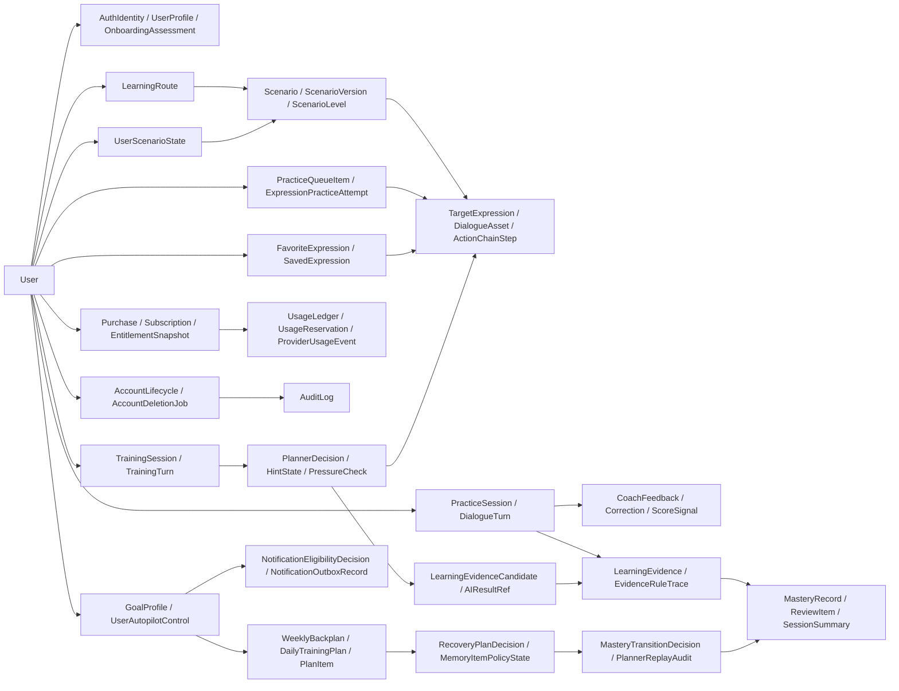

# Entity Relationship

## 状态

Proposed - Domain Schema Baseline + P0/P0.1/P0.2 Extension companion document。

状态：拟议；本文是 Domain Schema baseline 与 P0/P0.1/P0.2 扩展的 companion document。

本文描述 Product Base accepted domain、P0 commercial extension、P0.1 training extension 和 P0.2 goal autopilot extension 的实体关系、ownership、cardinality 和跨域约束。本文不定义 API response shape，不写 database migration SQL，不修改 Flutter/backend 代码。

## Relationship Principles

- User 是账号、学习、订阅、用量、删除和审计链路的根实体。
- Scenario / ScenarioVersion / TargetExpression 是官方内容和训练目标的稳定引用。
- PracticeSession 保留 Product Base 语音场景模拟语义；TrainingSession 是 P0.1 训练型 Agent 的更严格 session 内训练事实。
- LearningEvidence 是学习沉淀的核心事实；LLM 只能产生 candidate，accepted evidence 必须由 deterministic evidence rules 写入。
- Subscription / EntitlementSnapshot / UsageLedger 是 P0 商业化可信边界，不能由 Flutter 本地状态最终决定。
- AccountDeletionJob 负责处理 User 相关数据删除或匿名化；AuditLog 保留最小脱敏审计事实。
- P0.2 Followup-B control/planner/memory 对象进入当前关系图作为 implementation-gated planned contract；P1/P2 对象仍只作为 deferred boundary。

## High-Level Ownership Graph

## Product Base Accepted Relationships

| From | Relationship | To | Cardinality | Owner / source of truth | Notes |
| --- | --- | --- | --- | --- | --- |
| User | has | AuthIdentity | 1 -> many | Identity backend | 多登录方式绑定；生产身份由后端校验。 |
| User | has | UserProfile | 1 -> 1 | Identity backend, Flutter cache | Flutter 可缓存展示，不拥有最终账号事实。 |
| User | completes | OnboardingAssessment | 1 -> many | Onboarding domain | 支持后续重评；当前门禁只需要 completed 状态。 |
| OnboardingAssessment | creates or updates | LearningRoute | 1 -> 0..1 current route | Onboarding + Content domain | 只写入当前真实官方场景。 |
| LearningRoute | selects | Scenario | many -> many via route items | Content domain | 当前可选真实场景为 `job_interview`、`onboarding_introduction`。 |
| User | owns | UserScenarioState | 1 -> many | Onboarding + Content backend | 加入、移除、设为当前和等级切换的服务端事实源；user + scenario 必须唯一。 |
| UserScenarioState | selects | Scenario | many -> 1 | Content domain | 只能引用两个 Product Base 官方场景；移除状态不得作为 current scene。 |
| Scenario | has | ScenarioVersion | 1 -> many | Content domain | 练习和证据应引用版本，避免内容漂移。 |
| ScenarioVersion | has | ScenarioLevel | 1 -> many | Content domain | 当前 L1/L2/L3，不等同完整 A1-C2。 |
| ScenarioVersion | has | TargetExpression | 1 -> many | Content domain | 表达需要稳定 ID。 |
| ScenarioVersion | has | DialogueAsset | 1 -> many | Content domain | 听力热身和示范输入来源。 |
| ScenarioVersion | has | ActionChainStep | 1 -> many | Content + Training domain | Product Base 草案已有 action chain；P0.1 强化为 planner 输入。 |
| User | joins | Scenario | many -> many via UserScenarioState | Content + Identity domain | 加入、移除、设为当前影响首页和练习入口。 |
| User | starts/resumes | PracticeSession | 1 -> many | Training domain | 同用户、场景、等级可恢复未完成会话。 |
| PracticeSession | contains | DialogueTurn | 1 -> many | Training domain | Turn 顺序必须稳定；同 session + idempotency key 不得重复创建 turn。 |
| DialogueTurn | may produce | CoachFeedback | 1 -> 0..many | AI Gateway + Training domain | 反馈可能来自 AI 或 deterministic fallback；invalid provider schema 不得成为 successful feedback。 |
| DialogueTurn | may produce | Correction | 1 -> 0..many | Learning Evidence domain | Correction 必须引用 source turn。 |
| DialogueTurn | may produce | ScoreSignal | 1 -> 0..many | AI Gateway domain | 分数不单独决定最终掌握。 |
| User | owns | PracticeQueueItem | 1 -> many | Training / Review domain | 队列来自复习、薄弱和变体，需去重。 |
| PracticeQueueItem | targets | TargetExpression | many -> 1 | Content + Training domain | 任务目标必须可追溯。 |
| PracticeQueueItem | receives | ExpressionPracticeAttempt | 1 -> many | Training domain | attempt 结果影响进度、复习或掌握关联。 |
| User | owns | FavoriteExpression | 1 -> many | Learning Assets domain | user + expression/normalized_text 去重。 |
| FavoriteExpression | references | TargetExpression | many -> 0..1 | Learning Assets + Content domain | 用户自由保存时也可只保留 normalized text 和 source。 |
| User | owns | SavedExpression | 1 -> many | Learning Assets domain | P1 notebook 扩展后置。 |
| PracticeSession | ends with | SessionSummary | 1 -> 0..1 | Learning Evidence domain | 完成练习后展示 recap 并影响后续入口。 |
| PracticeSession / DialogueTurn / Correction / Attempt | generates | LearningEvidence | many -> many via source refs | Learning Evidence domain | Product Base 可本地优先；P0.1 后服务端 accepted evidence 为事实。 |
| LearningEvidence | updates | MasteryRecord | many -> 1 target record | Learning Evidence domain | 掌握变化必须保留 last evidence。 |
| LearningEvidence | may create | ReviewItem | 1 -> many | Review domain | 收藏本身不等于自动复习，必须有规则。 |
| User | owns | LearningHistoryEntry | 1 -> many | Profile / Learning domain | 历史删除是用户历史管理，不等同账号删除。 |

## P0 Commercial Relationships

| From | Relationship | To | Cardinality | Owner / source of truth | Notes |
| --- | --- | --- | --- | --- | --- |
| User | may purchase | Purchase | 1 -> many | Commerce backend | Purchase 由后端校验商店凭据后记录。 |
| Purchase | refers to | SubscriptionPlan | many -> 1 | Commerce backend | plan/product_id 必须与商店和会员文案一致。 |
| Purchase | creates or updates | Subscription | many -> 0..1 active projection | Commerce backend | provider transaction id 去重。 |
| Subscription | produces | EntitlementSnapshot | 1 -> many | Entitlement backend | 当前 snapshot 是客户端展示缓存来源。 |
| EntitlementSnapshot | evaluates | EntitlementRule | many -> many | Entitlement backend | 规则可引用 feature_key、quota、scenario scope。 |
| EntitlementRule | may gate | Scenario | many -> many | Entitlement + Content domain | 如果场景包是权益，场景列表/详情/训练入口必须一致。 |
| EntitlementRule | may gate | AI/provider usage | many -> many | Entitlement + Usage domain | 高成本能力先过权益和用量。 |
| User | owns | UsageLedger | 1 -> many | Usage Control backend | 按 usage family 和周期聚合。 |
| UsageLedger | has | UsageReservation | 1 -> many | Usage Control backend | reserve 必须 commit/release/expire。 |
| UsageReservation | records | ProviderUsageEvent | 1 -> 0..many | Usage Control + AI Gateway | provider failure 也需可审计。 |
| Subscription | receives | PaymentProviderEvent | 1 -> many | Commerce backend | webhook/provider event 去重并幂等处理。 |
| User | has | AccountLifecycle | 1 -> 1 | Identity backend | 删除中或已删除账号不得继续产生新业务事实。 |
| AccountLifecycle | starts | AccountDeletionJob | 1 -> many | Admin/Ops backend | 删除 job 状态机独立运行。 |
| AccountDeletionJob | affects | PracticeSession / TrainingSession / LearningEvidence / FavoriteExpression / SavedExpression / Profile data | 1 -> many | Admin/Ops + owning domains | 按 hard delete、anonymize、retain-for-audit 分类处理。 |
| Purchase / Subscription / UsageReservation / AccountDeletionJob | writes | AuditLog | many -> many | Admin/Ops backend | 审计为 append-only、脱敏最小字段。 |

### P0 Relationship Gate Notes

| Gate | Relationship requirement | Covered by |
| --- | --- | --- |
| P0-COM-DOM-001 | 付款、恢复、退款、过期和宽限期必须能从 provider event 追踪到用户权益 | `User -> Purchase -> Subscription -> EntitlementSnapshot` and `Subscription -> PaymentProviderEvent` |
| P0-COM-DOM-001 | 场景包和 AI 高成本能力的 gating 必须由同一权益规则解释 | `EntitlementSnapshot -> EntitlementRule -> Scenario` and `EntitlementRule -> AI/provider usage` |
| P0-COM-DOM-001 | 用量扣减必须能从 provider 调用结果回写到 reservation 状态 | `UsageLedger -> UsageReservation -> ProviderUsageEvent` |
| P0-COM-DOM-001 | 账号注销必须处理学习数据和审计数据的不同保留策略 | `AccountLifecycle -> AccountDeletionJob -> owning domain data` and `AccountDeletionJob -> AuditLog` |

## P0.1 Training Relationships

专项关系与生命周期细节见 `docs/domain/training_model.md`；本节保留 P0.1 与 Product Base/P0 领域图的关系入口。

| From | Relationship | To | Cardinality | Owner / source of truth | Notes |
| --- | --- | --- | --- | --- | --- |
| User | starts/resumes | TrainingSession | 1 -> many | Training Planner domain | P0.1 session 只限两个官方场景。 |
| TrainingSession | references | ScenarioVersion | many -> 1 | Content domain | 内容版本必须可追溯。 |
| TrainingSession | targets | ScenarioLevel | many -> 1 | Content domain | 当前训练等级来自用户选择。 |
| TrainingSession | progresses through | ActionChainStep | many -> many ordered | Content + Training domain | step 限定为开场、说明目的、表达观点、回应追问、确认下一步、结束。 |
| ActionChainStep | uses | TargetExpression | many -> many | Content domain | 当前 step 可有目标表达或表达簇。 |
| TrainingSession | contains | TrainingTurn | 1 -> many | Training Planner domain | 每次 micro-action 尝试形成 turn。 |
| TrainingTurn | performs | MicroAction | many -> 1 current action | Training Planner domain | 听一句、选一个、回一句、跟一句、补一句、追问继续说。 |
| TrainingSession | has | HintState | 1 -> 0..1 current | Training Planner domain | hint ladder 随失败/通过升降。 |
| TrainingTurn | leads to | PlannerDecision | 1 -> 0..many | Training Planner domain | 决策必须 deterministic，可测试和可回放。 |
| PlannerDecision | selects | MicroAction | many -> 1 next action | Training Planner domain | 下一步动作不能由自由 LLM 直接决定。 |
| PlannerDecision | may trigger | PressureCheck | 1 -> 0..1 | Training Planner domain | 只限 session 内轻量追问或近场景复现。 |
| TrainingTurn | may call | AIResultRef | 1 -> 0..many | AI Gateway domain | AI 输出必须 schema validation。 |
| AIResultRef | may create | LearningEvidenceCandidate | 1 -> many | Learning Evidence domain | candidate 不直接更新 mastery。 |
| PlannerDecision / Evidence rules | accept or reject | LearningEvidenceCandidate | many -> many | Learning Evidence domain | accepted 后才成为 LearningEvidence。 |
| LearningEvidence | updates | MasteryRecord | many -> 1 | Learning Evidence domain | rule trace 必须保留。 |
| LearningEvidence | may schedule | ReviewItem | 1 -> many | Review domain | P0.1 只写回本轮证据，不承诺跨天调度。 |
| TrainingSession | ends with | TrainingRecap | 1 -> 0..1 | Training + Learning Evidence | recap 不得因 evidence 写回失败而丢失。 |

### P0.1-DOM-001 Relationship Gate Notes

| Gate | Relationship requirement | Covered by |
| --- | --- | --- |
| P01-GAP-001 | Session planner 必须能从 session、step、micro-action、hint、turn 和反馈信号生成可回放决策 | `TrainingSession -> ActionChainStep -> MicroAction -> TrainingTurn -> PlannerDecision` |
| P01-GAP-001 | Hint ladder 必须能随失败/通过升降，并在 UI 可见 | `TrainingSession -> HintState` and `PlannerDecision -> next MicroAction` |
| P01-GAP-001 | Pressure check 只能由 session 内连续通过触发，失败回到更高支架 | `PlannerDecision -> PressureCheck -> TrainingTurn` |
| P01-GAP-001 | 学习证据必须从候选到 accepted evidence，LLM 不直接写最终 mastery | `TrainingFeedback -> LearningEvidenceCandidate -> LearningEvidence -> MasteryRecord` |
| P01-GAP-001 | Recap 必须在 evidence 写回失败时仍可见 | `TrainingSession -> TrainingRecap` independent from `LearningEvidenceCandidate -> LearningEvidence` |

## P0.2 Goal Autopilot Followup-B Relationships

Owning increment: `docs/product/increments/p0-2-followup-b-autopilot-control-planner-memory/`。

归属增量：`docs/product/increments/p0-2-followup-b-autopilot-control-planner-memory/`。

本节是 Followup-B 的 planned relationship contract。它定义后续 API/OpenAPI、UX、AI runtime 和 backend 实现输入，但不声明这些关系已在代码或数据库中实现。

| From | Relationship | To | Cardinality | Owner / source of truth | Notes |
| --- | --- | --- | --- | --- | --- |
| User | owns | UserAutopilotControl | 1 -> many active per goal context | Autopilot Control backend | 控制状态是服务端事实；Flutter 只能提交 intent 和展示返回状态。 |
| UserAutopilotControl | controls | GoalProfile / WeeklyBackplan / DailyTrainingPlan / PlanItem | 1 -> many scoped to active goal revision | Autopilot Control + Planner domain | pause、policy block、quiet hours 和 consent 会阻断 autopilot prompt、next-action advancement 或 reminder eligibility。 |
| UserAutopilotControl | produces | NotificationEligibilityDecision | 1 -> many | Autopilot Notification domain | 每次 schedule/reschedule/send 前必须评估 control、quiet hours、permission、consent、entitlement、quota、plan/support status。 |
| NotificationEligibilityDecision | gates | NotificationOutboxRecord | 1 -> 0..many | Autopilot Notification domain | blocked decision 不得变成 sent record，也不得写 completion/refusal/missed-day evidence。 |
| NotificationOutboxRecord | references | PlanItem | many -> 0..1 | Autopilot Notification + Planner domain | dedupe key 覆盖 user、goal revision、plan item、reminder slot 和 rule version。 |
| DailyTrainingPlan / PlanItem | triggers | RecoveryPlanDecision | many -> many via source event | Planner Recovery domain | missed、skip、defer、resume after pause gap、stale plan 或 expired item 触发 recovery。 |
| RecoveryPlanDecision | updates or supersedes | DailyTrainingPlan / PlanItem | 1 -> many | Planner domain | recovery 必须选择 compress、defer 或 replace 之一，不得堆积所有 overdue tasks。 |
| TargetExpression / Scenario / diagnostic weakness tag / PlanItem | has | MemoryItemPolicyState | many -> many via stable item refs | Learning Memory + Planner domain | memory scheduling 进入 item-level；overlearning cap 和 interleaving 必须可测试。 |
| MemoryItemPolicyState | produces | MasteryTransitionDecision | 1 -> many | Learning Memory domain | transition 只能使用 accepted evidence；AI final mastery/review schedule 字段不得持久化。 |
| MasteryTransitionDecision | updates | MasteryRecord or goal mastery projection | many -> 1 target aggregate | Learning Memory domain | L0-L5 是产品内部掌握态，不等同官方考试认证。 |
| UserAutopilotControl / NotificationEligibilityDecision / NotificationOutboxRecord / RecoveryPlanDecision / MemoryItemPolicyState / MasteryTransitionDecision | writes | PlannerReplayAudit | many -> many by decision family | Planner Audit domain | replay audit 保存最小 input/output snapshot hash、reason code、rule version 和 replay hash。 |

### P0.2 Followup-B Relationship Gate Notes

| Gate | Relationship requirement | Covered by |
| --- | --- | --- |
| P02-FUB-TR-001 | 自动带练控制必须是服务端事实，且可阻断 unsupported、partial、stale、missing plan 和 policy-blocked 状态 | `User -> UserAutopilotControl -> GoalProfile/PlanItem` |
| P02-FUB-TR-002 | Pause/resume/update-control 必须影响 prompt、next-action 和 reminder eligibility，但不删除 recoverable goal/plan/memory/evidence facts | `UserAutopilotControl -> GoalProfile/WeeklyBackplan/DailyTrainingPlan/PlanItem` |
| P02-FUB-TR-003 | Quiet hours、permission、consent、entitlement、quota、support 和 plan status 必须在 reminder 前评估 | `UserAutopilotControl -> NotificationEligibilityDecision` |
| P02-FUB-TR-004 | Reminder 必须通过 lifecycle outbox，并且支持 dedupe、cancel、reschedule 和 failure recovery | `NotificationEligibilityDecision -> NotificationOutboxRecord -> PlanItem` |
| P02-FUB-TR-005 | Missed-day recovery 必须由 plan/item/source event 生成 compress/defer/replace 决策，不得堆积 overdue tasks | `DailyTrainingPlan/PlanItem -> RecoveryPlanDecision -> DailyTrainingPlan/PlanItem` |
| P02-FUB-TR-006 | Memory scheduling 必须按 item-level state 计算 due decision、overlearning cap 和 interleaving | `TargetExpression/Scenario/diagnostic weakness tag/PlanItem -> MemoryItemPolicyState` |
| P02-FUB-TR-007 | L0-L5 promotion/demotion/hold 必须从 accepted evidence 到 transition decision，再更新 mastery aggregate | `MemoryItemPolicyState -> MasteryTransitionDecision -> MasteryRecord` |
| P02-FUB-TR-008 | 控制、通知、恢复、memory due 和 mastery transition 必须能用 fixture replay | `*Decision -> PlannerReplayAudit` |

## MVP Learning/Memory Increment Relationships

Owning increment: `docs/product/increments/mvp-backend-learning-memory/`.

归属增量：`docs/product/increments/mvp-backend-learning-memory/`。

| Implemented relationship | Evidence |
| --- | --- |
| User -> PracticeQueueItem -> TargetExpression | `/expressions/queue` returns joined-scenario expression tasks, stable target IDs, priority and explicit empty states. |
| PracticeQueueItem -> ExpressionPracticeAttempt -> LearningEvidence | `/expressions/tasks/{queue_item_id}/complete` persists attempts and projects high/low score into accepted learning evidence. |
| User -> FavoriteExpression -> TargetExpression | `/favorites/expressions` is idempotent by user and stable target expression, and delete removes the item from the active list. |
| LearningEvidence -> MasteryRecord / ReviewItem / SavedExpression / LearningHistoryEntry | Accepted evidence updates mastery, schedules review, saves a personal wiki entry, records history, and creates a follow-up queue item. |
| LearningHistoryEntry deletion | `/learning/history/{history_entry_id}` soft-deletes history visibility without deleting saved wiki evidence. |

中文等价说明：

- `User -> PracticeQueueItem -> TargetExpression`：`/expressions/queue` 返回已加入场景的 expression tasks、稳定 target IDs、priority 和明确空状态。
- `PracticeQueueItem -> ExpressionPracticeAttempt -> LearningEvidence`：`/expressions/tasks/{queue_item_id}/complete` 持久化 attempts，并把 high/low score 投影到 accepted learning evidence。
- `User -> FavoriteExpression -> TargetExpression`：`/favorites/expressions` 按 user 和 stable target expression 保持幂等，delete 会从 active list 移除该项。
- `LearningEvidence -> MasteryRecord / ReviewItem / SavedExpression / LearningHistoryEntry`：accepted evidence 会更新 mastery、安排 review、保存 personal wiki entry、记录 history，并创建 follow-up queue item。
- `LearningHistoryEntry deletion`：`/learning/history/{history_entry_id}` 仅软删除 history visibility，不删除 saved wiki evidence。

These implemented relationships close MVP-BE-GAP-006 for MVP-BE-TR-007 and MVP-BE-TR-010. P0.2 Followup-B planned relationships above do not change MVP implementation evidence status; backend implementation remains gated by contracts, code, tests and independent review.

这些已实现关系关闭 MVP-BE-GAP-006，并覆盖 MVP-BE-TR-007 与 MVP-BE-TR-010。上方 P0.2 Followup-B planned relationships 不改变 MVP implementation evidence status；backend implementation 仍受 contracts、code、tests 和 independent review gate 约束。

## MVP Membership/Boundary Increment Relationships

Owning increment: `docs/product/increments/mvp-backend-membership-boundary/`.

归属增量：`docs/product/increments/mvp-backend-membership-boundary/`。

| Implemented relationship | Evidence |
| --- | --- |
| User -> AccountDeletionJob | `DELETE /user/me` creates and completes the latest deletion job for the authenticated user. |
| AccountDeletionJob -> AuthSession | Account deletion revokes user sessions; previous access and refresh tokens fail after completion. |
| AccountDeletionJob -> Profile / Onboarding / Practice / Learning data | User-owned Product Base rows are deleted while the account row is retained only as a deleted identity marker. |
| AccountDeletionJob -> AuditLog | Completion or failure is auditable with redacted details and request id. |
| User -> Membership boundary / placeholder facts | Membership, Android billing, report, offline content, and achievement endpoints return explicit MVP boundary states rather than implied commercial readiness. |

中文等价说明：

- `User -> AccountDeletionJob`：`DELETE /user/me` 为 authenticated user 创建并完成最新 deletion job。
- `AccountDeletionJob -> AuthSession`：账号删除会撤销 user sessions；删除完成后，既有 access token 和 refresh token 都应失效。
- `AccountDeletionJob -> Profile / Onboarding / Practice / Learning data`：用户自有 Product Base rows 被删除，account row 仅保留为 deleted identity marker。
- `AccountDeletionJob -> AuditLog`：完成或失败都必须带 redacted details 和 request id，可被审计。
- `User -> Membership boundary / placeholder facts`：Membership、Android billing、report、offline content 和 achievement endpoints 返回明确 MVP boundary states，而不是暗示 commercial readiness。

These relationships close MVP-BE-GAP-008 and MVP-BE-GAP-009 for MVP-BE-TR-011 and MVP-BE-TR-012; complete commercial subscription, payment provider integration, paid reports, offline packages, and achievements remain deferred to their owning increments.

这些关系关闭 MVP-BE-GAP-008 和 MVP-BE-GAP-009，并覆盖 MVP-BE-TR-011 与 MVP-BE-TR-012；完整 commercial subscription、payment provider integration、paid reports、offline packages 和 achievements 仍 deferred 到各自 owning increments。

## Deletion / Retention Relationship Rules

| Data class | Relationship under account deletion |
| --- | --- |
| UserProfile / OnboardingAssessment / LearningRoute | 删除或匿名化，删除后不得恢复为可登录账号。 |
| PracticeSession / TrainingSession / DialogueTurn / TrainingTurn | 删除或匿名化用户关联；如需保留聚合质量数据，必须去标识化。 |
| Audio refs / Transcript refs | 按 Security/DevOps 后续 retention policy 删除或失效引用。 |
| FavoriteExpression / SavedExpression / LearningHistoryEntry | 用户自有学习资产，应随账号删除清理。 |
| LearningEvidence / MasteryRecord / ReviewItem | 删除或匿名化，且不得破坏必要脱敏审计可读性。 |
| GoalProfile / UserAutopilotControl / NotificationEligibilityDecision / NotificationOutboxRecord / RecoveryPlanDecision / MemoryItemPolicyState / MasteryTransitionDecision / PlannerReplayAudit | 删除或匿名化用户关联；如需保留 replay 或 policy audit，只能保留最小脱敏 hash、rule version、reason code 和时间戳。 |
| Purchase / Subscription / PaymentProviderEvent | 按财务、商店争议和合规要求保留最小脱敏审计字段。 |
| AuditLog | 保留最小必要字段；target_ref 可匿名化；不得包含完整凭据、token、raw audio 或敏感对话。 |

## P0 Commercial AI Provider Operations Relationships

Owning increment：`commercial-ai-provider-hardening`。这些关系是 `P0-AI-ARCH-001` 的架构/API/security 契约输入，后续 Backend/QA/Ops/Security 实现不得绕过。

| Source entity | Relationship | Target entity | Cardinality | Owner | Rule |
| --- | --- | --- | --- | --- | --- |
| User | owns | MediaAsset | 1 -> many | Media Storage | 每个录音 media ref 必须有服务端 owner，客户端不能提交裸 URL 作为生产 ASR 输入。 |
| MediaAsset | may be source for | TranscribeRequest / PronunciationRequest | 1 -> many | AI Gateway | `/ai/transcribe` 和 `/ai/pronunciation` 只接受 validated backend media refs。 |
| MediaAsset | may back | TtsCacheEntry | 1 -> many | Media Cache | TTS 输出对象通过 media_id/audio_ref 复用，不暴露对象存储内部 key。 |
| User | may own | TtsCacheOwner | 1 -> many hashed refs | Media Cache / Security | TTS cache 多租户复用必须按 user hash 记录 owner ref；账号删除删除该用户 ref，最后一个 owner 删除时才删除 cache entry。 |
| TtsCacheOwner | references | TtsCacheEntry | many -> one | Media Cache / Security | shared cache 不再依赖 first-owner 字段；legacy `owner_hash` 仅作为旧数据兜底。 |
| TtsCacheEntry | references | ProviderInvocationMetric | many -> many aggregate | Usage / Ops | cache hit/miss 必须进入成本聚合，不能只作为进程内行为。 |
| ProviderSandboxRun | validates | AiProviderGateway capability | many -> one capability | AI Runtime / QA | LLM、ASR、TTS 每类能力都需要 approved evidence 才能关闭 paid AI voice gate。 |
| ProviderInvocationMetric | rolls up from | UsageReservation / provider call | many -> many | Usage / Ops | 成本看板只读 user hash、plan、provider、model、status、cache hit、duration/token estimate 和 cost。 |
| RetentionPolicy | governs | MediaAsset / TtsCacheEntry / provider payload refs | 1 -> many | Security / Ops | retention policy 决定删除、匿名化或保留最小审计字段。 |
| AiRetentionJob | executes | RetentionPolicy | many -> one policy version | Security / Backend | retention/account deletion job 必须记录 redacted evidence ref 和 retry/manual failure 状态。 |

### P0-AI-ARCH-001 Relationship Gate Notes

| Gate | Relationship requirement | Covered by |
| --- | --- | --- |
| COM-AI-GAP-001 | Flutter 录音必须先变成服务端-owned MediaAsset，再生成可信 `audio_ref` | `User -> MediaAsset -> TranscribeRequest` |
| COM-AI-GAP-002 | TTS cache 必须持久化到 media/cache 关系，支持重启、多实例、expiry 和删除 hook | `MediaAsset -> TtsCacheEntry -> ProviderInvocationMetric` |
| COM-AI-GAP-003 | 真实 provider evidence 是 release gate，不是普通测试日志 | `ProviderSandboxRun -> AiProviderGateway capability` |
| COM-AI-GAP-004 | 成本看板必须从 provider call/usage/cache 汇总，不暴露原始内容 | `UsageReservation -> ProviderInvocationMetric` |
| COM-AI-GAP-005 | 账号删除和 retention job 必须覆盖音频、转写、provider payload 和 TTS cache | `RetentionPolicy -> AiRetentionJob -> MediaAsset/TtsCacheEntry` |

## No-Cycle Ownership Rules

| Rule | Explanation |
| --- | --- |
| Content owns authored content | Scenario、ScenarioVersion、ScenarioLevel、TargetExpression、DialogueAsset、ActionChainStep 不由用户学习记录反向拥有。 |
| Session owns turns | PracticeSession/TrainingSession 拥有 DialogueTurn/TrainingTurn；turn 不拥有 session。 |
| Evidence references source | LearningEvidence 引用 source turn/attempt/correction，但不拥有 source。 |
| Mastery is aggregate | MasteryRecord 由 evidence 更新，不反向拥有 evidence。 |
| Entitlement gates access, not content truth | EntitlementRule 可限制场景或 AI 能力访问，但不改变 Scenario 内容本身。 |
| Usage records consumption, not provider truth | ProviderUsageEvent 记录调用事实和成本，不保存 provider secret 或完整 raw payload。 |
| Media refs are server facts | MediaAsset 负责 provider-accessible ref；客户端本地路径、裸 URL 或对象存储内部 key 都不是生产 ASR 事实。 |
| Cache metadata is not user text | TtsCacheEntry 只保存 normalized text hash/model/voice/language/media ref，不保存完整敏感文本。 |
| Cost metrics are sanitized aggregates | ProviderInvocationMetric 可被 PM/Ops 查看，但不得包含 raw audio、raw transcript、完整 signed URL 或 provider payload。 |
| Deletion orchestrates, not owns business history | AccountDeletionJob 管理删除流程，但被处理数据仍归各 domain 定义处理策略。 |
| Autopilot control gates actions, not content truth | UserAutopilotControl 可阻断 prompt、next-action 和 reminder eligibility，但不改变 Scenario、TargetExpression 或 accepted evidence 的事实。 |
| Reminder outbox is delivery state, not learning evidence | NotificationOutboxRecord 的 blocked/failed/expired 不得被解释为用户完成、拒绝、失败或 missed-day evidence。 |
| Replay audit minimizes sensitive state | PlannerReplayAudit 只能保存最小 hash、reason code、rule version 和 redacted refs，不保存完整诊断文本、transcript、raw audio 或 provider payload。 |

## API Contract Inputs From Relationships

| API family | Relationship inputs needed |
| --- | --- |
| Auth / User | User、AuthIdentity、UserProfile、AccountLifecycle、AccountDeletionJob |
| Scenario | Scenario、ScenarioVersion、ScenarioLevel、TargetExpression、DialogueAsset、ActionChainStep |
| Training / Practice | PracticeSession、DialogueTurn、TrainingSession、TrainingTurn、MicroAction、PlannerDecision、HintState、PressureCheck |
| Learning / Review | LearningEvidence、EvidenceRuleTrace、MasteryRecord、ReviewItem、FavoriteExpression、SavedExpression、SessionSummary |
| Subscription / Entitlement | SubscriptionPlan、Purchase、Subscription、EntitlementSnapshot、EntitlementRule、PaymentProviderEvent |
| Usage / AI Gateway | UsageLedger、UsageReservation、ProviderUsageEvent、AIResultRef、ScoreSignal、ProviderInvocationMetric |
| Media / AI Ops | MediaAsset、TtsCacheEntry、ProviderSandboxRun、RetentionPolicy、AiRetentionJob |
| Admin / Ops | AuditLog、AccountDeletionJob、PaymentProviderEvent、ProviderSandboxRun、AiRetentionJob |
| P0.2 Goal Autopilot | GoalProfile、UserAutopilotControl、NotificationEligibilityDecision、NotificationOutboxRecord、RecoveryPlanDecision、MemoryItemPolicyState、MasteryTransitionDecision、PlannerReplayAudit |

API Contract/OpenAPI 阶段必须从这些关系定义 authentication、authorization、idempotency、error codes、schema version 和 generated Dart client policy。本文不定义 request/response shape。

## Test Relationship Map

| Relationship area | Required test focus |
| --- | --- |
| User -> gate -> onboarding -> route | 启动门禁、首评完成条件、场景映射和日常服务排除。 |
| Scenario -> level -> expression -> practice | 双官方场景、等级切换、表达队列、听力热身和语音练习回归。 |
| Session -> turn -> feedback -> evidence | 会话恢复、turn 顺序、反馈失败、证据写回和 recap 保留。 |
| Provider gateway -> feedback fallback | provider timeout/unavailable/invalid schema 只能产出 typed fallback 或明确失败，不能写伪成功反馈。 |
| Favorite / saved expression -> review | 收藏去重、取消收藏、收藏不自动生成复习任务。 |
| Subscription -> entitlement -> gating | 购买/恢复/退款/过期、权益刷新、场景/AI gating 一致性。 |
| Usage ledger -> reservation -> provider event | reserve/commit/release、provider timeout、额度耗尽和滥用审计。 |
| Media asset -> trusted audio_ref -> ASR | upload/signing、非法 ref 拒绝、ASR ref resolution 和 hash-only audit。 |
| TTS cache entry -> media asset -> provider metric | persistent cache hit/miss/expiry/delete、provider 不重复调用和 cache hit 成本聚合。 |
| Provider sandbox run -> release gate | DashScope LLM/ASR/TTS latency、错误码、费用、格式兼容性、fallback 和独立审查。 |
| Provider invocation metric -> cost dashboard | 套餐、用户 hash、provider、模型、状态、cache hit、budget 和 margin risk 聚合。 |
| Training session -> planner -> hint/pressure | micro-action 单步训练、hint ladder、pressure check、ASR fallback。 |
| Candidate evidence -> accepted evidence -> mastery/review | LLM 不直接写 mastery、rule trace、低置信度拒绝、去重。 |
| User -> autopilot control -> plan/action | 服务端控制事实、pause/resume/update-control、policy block 和 Flutter 不本地覆盖。 |
| Autopilot control -> notification eligibility -> outbox | quiet hours、permission、consent、entitlement、quota、stale/missing plan reason code、dedupe、cancel/reschedule/failure recovery。 |
| Plan item -> recovery decision -> daily plan | missed-day、skip/defer、pause gap、stale plan、compress/defer/replace 和 no overdue stacking。 |
| Memory item state -> mastery transition -> replay audit | item-level due decision、overlearning cap、interleaving、L0-L5 promotion/demotion/hold、AI forbidden persistent fields 和 deterministic replay。 |
| Account deletion -> owned data -> audit | 云端删除/匿名化、本地清理、token 撤销、审计脱敏。 |
| Retention policy -> AI retention job -> media/cache cleanup | 音频、转写、provider payload、TTS cache 删除/匿名化和 redacted evidence。 |

## Explicit Deferred Relationships

| Deferred relationship | Reason |
| --- | --- |
| DailyPlan -> CrossSessionSchedule -> TrainingSession | Followup-B 已定义 planned recovery/control relationship；跨 session backend implementation 和训练会话编排仍待 implementation gate。 |
| MasteryRecord -> L0/L1/L2/L3/L4/L5 ladder | Followup-B 已定义 planned MasteryTransitionDecision；完整持久化实现、迁移和 UI 解释仍待 implementation gate。 |
| NotebookItem -> VocabularyLookup -> arbitrary phrase notes | P1 notebook-vocabulary。 |
| ScoreSignal -> ProductizedScoringRubric -> performance card | P1 scoring productization。 |
| ScenarioPackage -> CMSContentWorkflow -> CEFRMapping | P1/P2 content expansion and CMS。 |
| PublicUserScenario -> community sharing | Not now / non-goal。 |
